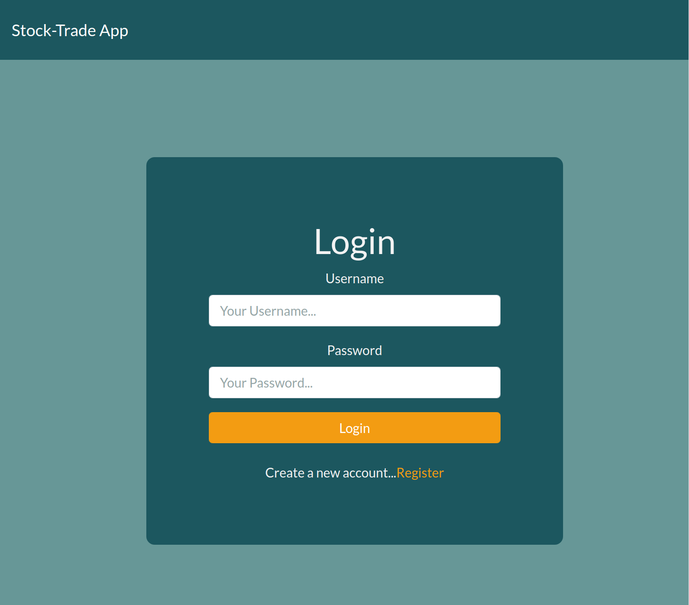
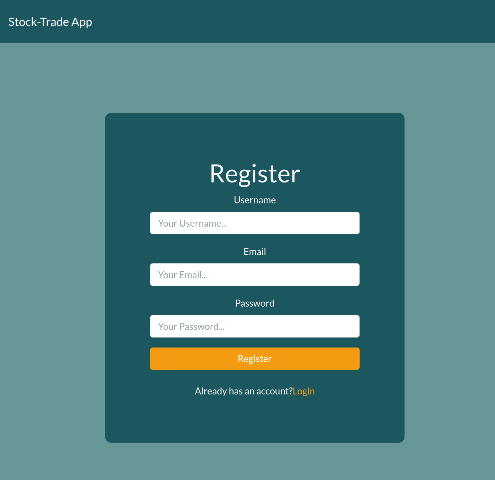
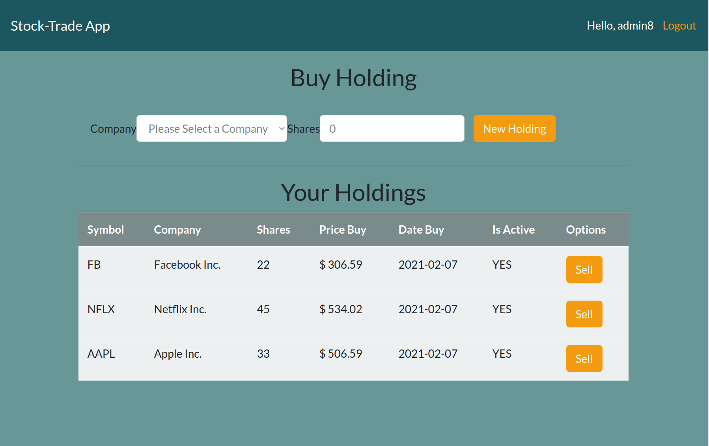

# Fantasy Stock Trade (React-Express-Typescript-MongoDB)

DONE: Refactoring API from JS to Typescript

_Stock tracker using fantasy money, built using express.js, react.js, and mongodb._

 

 

## Summary

Fantasy Stock Trade is an application the allows you the manage your holdings. The main objective of this project is to server as a learning tool, and familiarize myself with Expressjs for implementing an API using Postgresql(now Mongodb) as a Database, and consuming an external API as IEX Cloud, using React, and JsonWebtoken for authentication users, and jest and supertest for testing the API.

## How to Install

git clone https://github.com/marialobillo/stock-trade.git
cd stock-trade

### Setup Backend:

in the api/config/ folder you have the database url for setup your Mongodb database.

Please don't forget to install the dependencies:

`npm install`

And run the server:

`npm run start`

 

### Setup frontend:

For frontend we have to move to the clien folder so:

`cd client`

Again dependencies:

`npm install`

And for run the React app:

`npm run start`

 

## Author
 -  **Maria Lobillo-Santos** - Full-Stack Software Developer <a href="https://marialobillo.github.io" target="_blank">Website</a> | <a href="https://www.linkedin.com/in/lobillosantos/" 
 target="_blank">LinkedIn</a>
