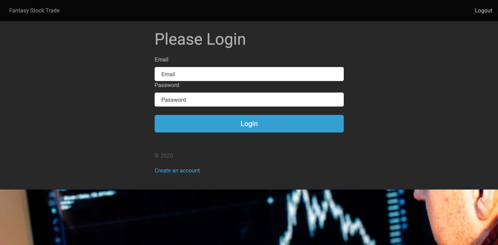

# Fantasy Stock Trade (React-Express-Postgresql)

_Stock tracker using fantasy money, built using express.js, react.js, and postgresql._

View like on Heroku  <a href="https://fant4sy-stock-trade.herokuapp.com/" target="_blank">Here</a>.

 

## Summary

Fantasy Stock Trade is an application the allows you the manage your holdings. The main objective of this project is to server as a learning tool, and familiarize myself with Expressjs for implementing an API using Postgresql as a Databaseand, and consuming an external API as IEX Cloud, using React Hooks and Jsonwebtoken for authentication users. 

## Author
 -  **Maria Lobillo-Santos** - Full-Stack Software Developer <a href="https://lobillosantos.com" target="_blank">Website</a> | <a href="https://www.linkedin.com/in/mar%C3%ADa-lobillo-santos/" target="_blank">LinkedIn</a>
